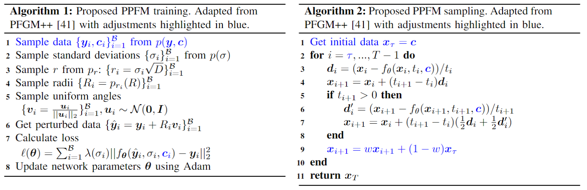

# PPFM: Image denoising in photon-counting CT using single-step posterior sampling Poisson flow generative models<br>

Pytorch implementation of the paper PPFM: Image denoising in photon-counting CT using single-step posterior sampling Poisson flow generative models<br>
by Dennis Hein, Staffan Holmin, Timothy Szczykutowicz, Jonathan S Maltz, Mats Danielsson, Ge Wang and Mats Persson

Abstract: *Diffusion and Poisson flow models have shown impressive performance in a wide range of generative tasks, including low-dose CT image denoising. However, one limitation in general, and for clinical applications in particular, is slow sampling speeds. Due to their iterative nature, the number of function evaluations (NFE) required to generate images of acceptable quality is usually on the order of $10-10^3$, both for conditional and unconditional generation. In this paper, we present posterior sampling Poisson flow generative models (PPFM), a novel image denoising technique for low-dose and photon-counting CT that produces excellent image quality whilst keeping NFE=1. Updating the training and sampling processes of Poisson flow generative models (PFGM)++, we learn a conditional generator which defines a trajectory between the prior noise distribution and the posterior distribution of interest. We additionally hijack and regularize the sampling process to achieve NFE=1. PFGM++ realize a generative model by treating the $N$-dimensional data as electric charges in a $N+D$-dimensional augmented space and include diffusion models as a special case. We show empirically that it is the additional robustness offered by choosing $D$, instead of keeping $D\rightarrow \infty$ fixed as for diffusion models, that enables excellent performance with NFE=1 as, for the same settings, the corresponding diffusion model fails. Our results demonstrate superior performance to current state-of-the-art diffusion-style models with NFE=1, consistency models, as well as popular deep learning and non-deep learning-based image denoising techniques, on clinical low-dose CT images and clinical images from a prototype photon-counting CT system.*

## Outline
This implementation is build upon the [PFGM++](https://github.com/Newbeeer/pfgmpp) repo which in turn builds on the [EDM](https://github.com/NVlabs/edm) repo. For transfering hyperparameters from EDM using the $r=\sigma\sqrt{D}$ formula, please see [PFGM++](https://github.com/Newbeeer/pfgmpp). Our suggested approach for image denoising via posterior sampling is shown in Algorithm 3, with adjustments to sampling algorithm in PFGM++ (Algorithm 1) highlighted in blue. Checkpoints for the [Mayo low-dose CT dataset](https://www.aapm.org/grandchallenge/lowdosect/) are provided in the [checkpoints](#checkpoints) section. 



## Training instructions from PFGM++
Our approach updates the training and smapling processes of [PFGM++](https://github.com/Newbeeer/pfgmpp). You can train new models using `train.py` For instance, to train PPFM with $D=128$ one runs 

```sh
python train.py --outdir=./cond-runs --data=./datasets/train_mayo_1_alt-512x512.zip \
--data_n=./datasets/train_mayo_1_alt-512x512.zip \
--pfgmpp=1 --aug_dim=128

data: data to be used (in .pt format)
data_n: data to be used (in .pt format). Data=data_n yields version of training used in the paper. 
aug_dim: D (additional dimensions)  
arch: model architectures. options: ncsnpp | ddpmpp
pfgmpp: use PFGM++ framework, otherwise diffusion models (D\to\infty case). options: 0 | 1

```
To get the two other models presented in the paper simply adjust `--pfgmpp` and `--aug_dim`
 
## Image denoising using PFGM++
Download pretrained weights and place in ./cond-runs/. Currently the generate_cond.py scripts requires dummy .dcm files in ./dicoms/ folder. One can easly adjust the code to circumvent this, however. To inference on the Mayo low-dose CT validation set using the best performing model ($D=64$) run: 
  ```zsh
  python generate_cond.py \
        --network=./cond_runs//training-state-003201.pt --batch=1 --data=val_mayo_1_alt \
--aug_dim=64 --steps=8 --hijack=1 --weight=0.7 --minmax train_mayo_1_alt_minmax

network: results used for inference 
data: data to be used (in .pt format)
steps: T (Algorithm 2) 
hijack: tau=T-hijack (Algorithm 2) 
weight: w (Algorithm 2) 
aug_dim: D (additional dimensions)  
```
For the $D \rightarrow \infty$ case, simply omitt the `--aug_dim` flag. 

## Checkpoints
We are unfortunately not able to share the checkpoints for the, proprietary, prior CT dataset. Checkpoints for the Mayo low-dose CT dataset are available (link will be updated) [here](https://drive.google.com/drive/folders/1mxRpIQgyuI2iDrMGgYJX-wuxzoX3NM6j?usp=drive_link). As with [PFGM++](https://github.com/Newbeeer/pfgmpp), most hyperparameters are taken directly from [EDM](https://github.com/NVlabs/edm). 
| Model                             | Checkpoint path                                              | $D$      |                           Options                            |
| --------------------------------- | :----------------------------------------------------------- | -------- | :----------------------------------------------------------: |
| ddpmpp-D-64              | [`PFGMpp_mayo_3mm_weights/D=64/`](https://drive.google.com/drive/folders/1CFNG_9Z3Aag7_C5OUEA5J2aDiighDyV3?usp=drive_link) | 64  |      `--cond=0 --arch=ddpmpp --cbase=128 --ares=16,8,4 --cres=1,1,2,2,2,2,2 --lr=2e-4 --dropout=0.1 --augment=0.15 --patch_sz=256 --n_patches=1 --batch=32 --fp16=1 --seed=41 --pfgmpp=1 --aug_dim=64`       |
| ddpmpp-D-128             | [`PFGMpp_mayo_3mm_weights/D=128/`](https://drive.google.com/drive/folders/1J37uKHXim7f0iWzntie1AFlJHOamHNsZ?usp=drive_link) | 128  |      `--cond=0 --arch=ddpmpp --cbase=128 --ares=16,8,4 --cres=1,1,2,2,2,2,2 --lr=2e-4 --dropout=0.1 --augment=0.15 --patch_sz=256 --n_patches=1 --batch=32 --fp16=1 --seed=41 --pfgmpp=1 --aug_dim=128`      |
| ddpmpp-D-inf (EDM)        | [`PFGMpp_mayo_3mm_weights/D=infty/`](https://drive.google.com/drive/folders/1-1eeJitL3Cg_cYUUoYC81JtT-7UF6sxz?usp=drive_link) | $\infty$ |                   `--cond=0 --arch=ddpmpp --cbase=128 --ares=16,8,4 --cres=1,1,2,2,2,2,2 --lr=2e-4 --dropout=0.1 --augment=0.15 --patch_sz=256 --n_patches=1 --batch=32 --fp16=1 --seed=41 --pfgmpp=0`                   |

## Preparing datasets 
Datasets are stored in the same format as in [StyleGAN](https://github.com/NVlabs/stylegan3): uncompressed ZIP archives containing uncompressed PNG files and a metadata file `dataset.json` for labels. Custom datasets can be created from a folder containing images; see [`python dataset_tool.py --help`](./docs/dataset-tool-help.txt) for more information. Updated dataset_tool_alt.py to read in data from .npy format. pt_to_np_mayo.ipynb will take the data tensor in .pt and save in .npy format that can be processed by dataset_tool_alt.py. You can find the Mayo data from the AAPM low-dose grand challenge [here](https://www.aapm.org/grandchallenge/lowdosect/). 

```.bash
python dataset_tool_alt.py --source=./datasets_unzipped/train_mayo_3_alt/ \
    --dest=datasets/mayo_3mm_alt-512x512.zip
```

## Instructions for setting up environment (from EDM)
- Python libraries: See `environment.yml`for exact library dependencies. You can use the following commands with Miniconda3 to create and activate your Python environment:
  - `conda env create -f environment.yml -n edm`
  - `conda activate edm`
- Docker users:
  - Ensure you have correctly installed the [NVIDIA container runtime](https://docs.docker.com/config/containers/resource_constraints/#gpu).
  - Use the [provided Dockerfile](https://github.com/dennishein/pfgmpp_PCCT_denoising/main/Dockerfile) to build an image with the required library dependencies.
